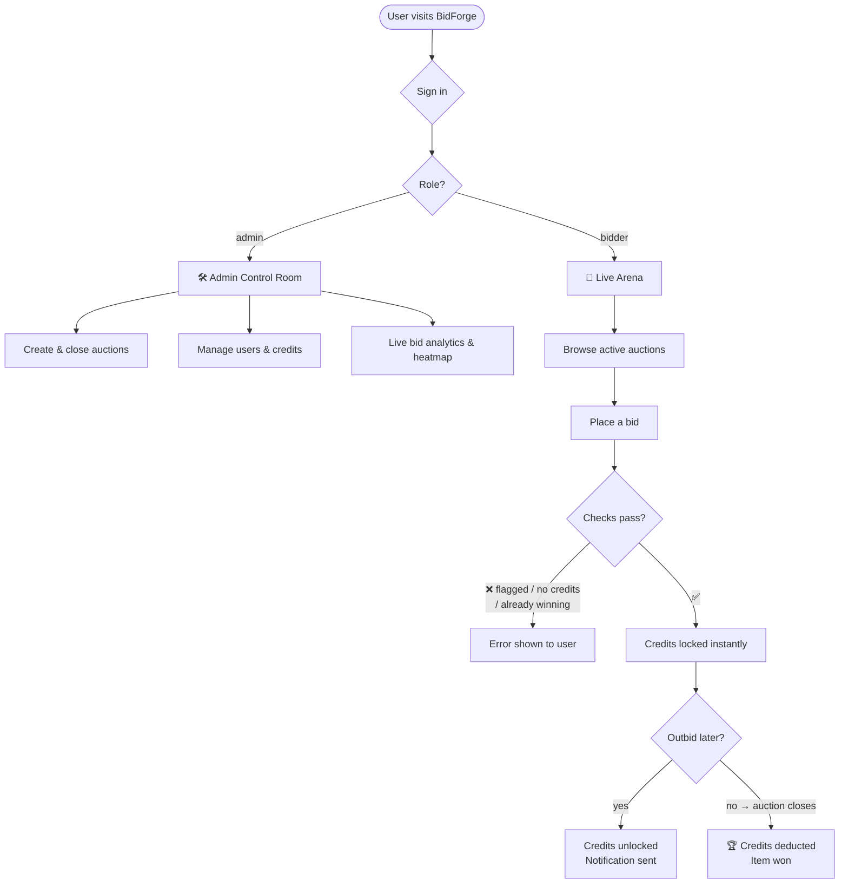
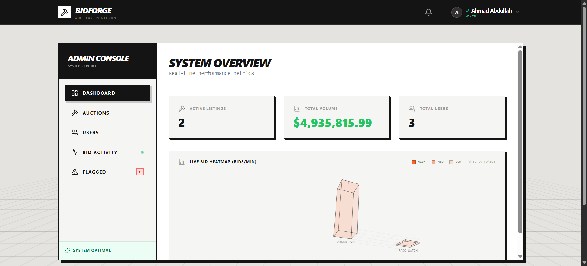
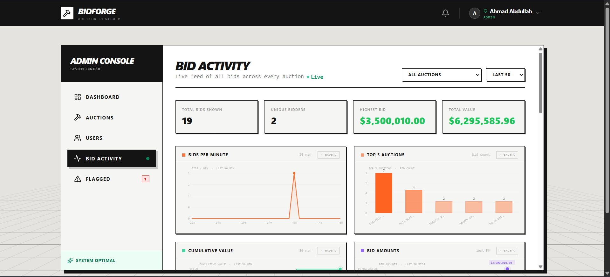
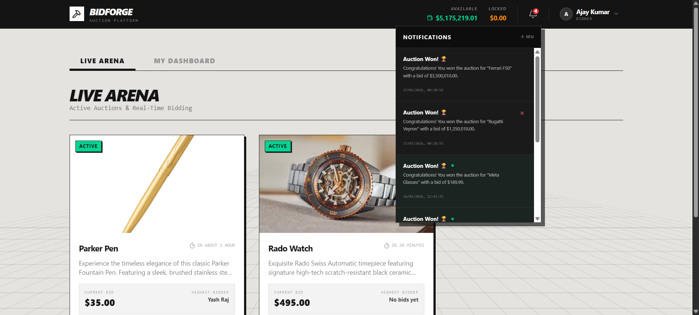
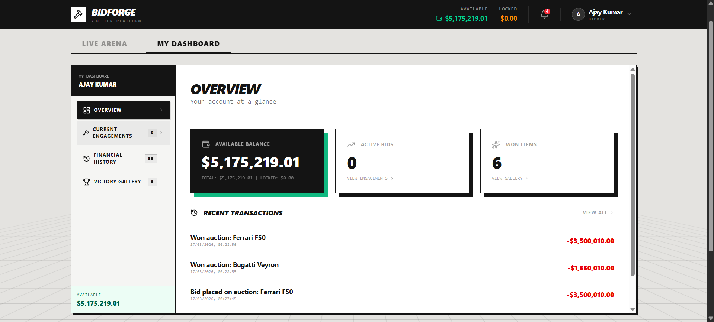
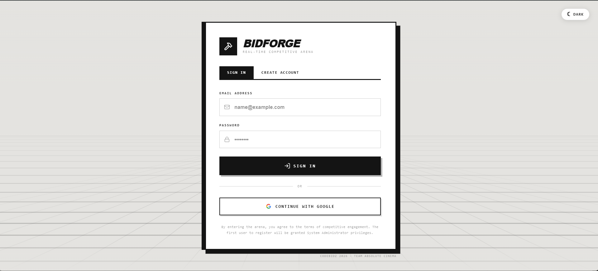
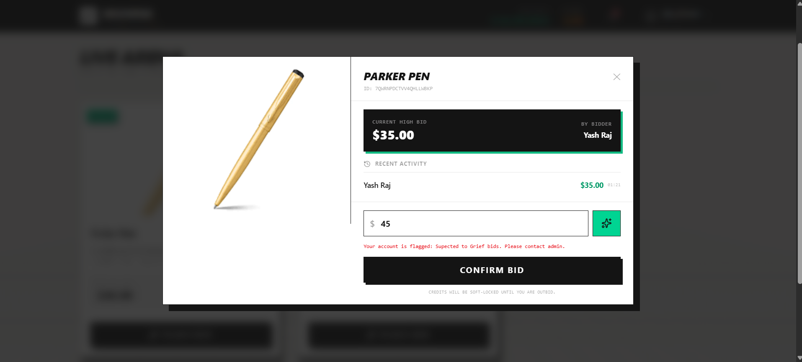

<div align="center">

# ⚒ BidForge

**Real-time competitive auction platform**

[](https://react.dev)
[](https://www.typescriptlang.org)
[](https://firebase.google.com)
[](https://vitejs.dev)
[](https://tailwindcss.com)

*CodeBidz 2026 · Team Absolute Cinema*

</div>

---

## What is BidForge?

BidForge is a full-stack real-time auction platform where users compete for items using a credit-based system. It ships two fully separate interfaces — a **Live Arena** for bidders and a **Control Room** for admins — both backed by Firebase Firestore with live updates and secured by role-based rules.

---

## How It Works



---

## Tech Stack

| | Technology |
|---|---|
| **Frontend** | React 19 · TypeScript 5.8 · Vite 6 |
| **Styling** | Tailwind CSS 4 · Motion animations |
| **Backend** | Firebase Firestore (real-time) · Firebase Auth |
| **Auth methods** | Email/Password · Google OAuth |
| **AI Assistant** | LLM API — auction descriptions & bid strategy |
| **Charts** | Pure Canvas 2D API (zero chart libraries) |

---

## Features

**Bidder**
- Live auction cards with countdown timers and real-time bid updates
- Atomic bid transactions — credits lock instantly, unlock automatically on outbid
- AI bidding strategy suggestion per auction
- Personal dashboard: balance overview, active engagements, transaction history, victory gallery
- In-app notifications for outbid and win events

**Admin**
- System dashboard with live stats and a draggable 3D bid-frequency heatmap
- Create / close / delete auctions with AI-assisted description generation
- Bid Activity tab: 4 live canvas charts (bids/min, top auctions, cumulative value, bid amounts) each expandable to full-screen with hover tooltips
- Live bid feed filterable by auction
- User management: search, top up credits, flag/unflag with reason
- Auction replay timeline for closed auctions

**Security**
- Firestore rules enforce role-based access at the database level
- All bids run inside Firestore transactions — no race conditions or double-spending
- Anti-spam: 3 bids in 10 seconds triggers an automatic flag
- Current high bidder cannot re-bid until outbid by someone else

---

## Screenshots

### Admin Control Room
| Dashboard & Heatmap | Bid Activity Charts |
|---|---|
|  |  |

### Bidder Experience
| Live Arena | Personal Dashboard |
|---|---|
|  |  |

### Auth & Bid Modal
| Login Page | Bid Modal |
|---|---|
|  |  |

> 📁 Drop your screenshots into a `/screenshots` folder in the project root and rename them to match the filenames above, or replace the paths with your own.

---

## Demonstration

[](https://youtu.be/WDX2_RT7Yy4)


---

## Setup

### Prerequisites
- Node.js 18+
- Firebase project with Firestore + Authentication enabled

### Steps

**1. Clone & install**
```bash
git clone https://github.com/your-username/bidforge.git
cd bidforge
npm install
```

**2. Add Firebase config**

Create `firebase-applet-config.json` in the project root:
```json
{
  "apiKey": "YOUR_API_KEY",
  "authDomain": "YOUR_PROJECT.firebaseapp.com",
  "projectId": "YOUR_PROJECT_ID",
  "storageBucket": "YOUR_PROJECT.appspot.com",
  "messagingSenderId": "YOUR_SENDER_ID",
  "appId": "YOUR_APP_ID",
  "firestoreDatabaseId": "(default)"
}
```

**3. Deploy Firestore rules**
```bash
npm install -g firebase-tools
firebase login && firebase init firestore
firebase deploy --only firestore:rules
```

**4. ⚠️ Set your admin email**

Replace the placeholder email in **two files** or you won't have admin access:

`src/hooks/useAuth.ts` — update this line (appears twice):
```ts
const isAdminEmail = firebaseUser.email === 'you@yourdomain.com';
```

`firestore.rules` — update this line:
```js
request.auth.token.email == "you@yourdomain.com"
```

> The very first user to register is also auto-promoted to admin regardless of email.

**5. AI assistant (optional)**
```bash
cp .env.example .env
# Add your API key to .env
```

**6. Run**
```bash
npm run dev        # http://localhost:3000
npm run build      # production build → dist/
```

---

## Known Limitations

| Limitation | Impact |
|---|---|
| No image upload — URLs only | Admins paste image links manually |
| No email notifications | Users must be logged in to see outcomes |
| No auction scheduling | Auctions start immediately on creation |
| No role management UI | Role changes require direct Firestore access |
| AI buttons require a valid API key | Non-functional without one |
| Google Sign-In needs authorised domains | Must be added in Firebase console for production |

---

<div align="center">
  <sub>Built with ⚒ by <strong>Ahmad Abdullah</strong> · Team Absolute Cinema · CodeBidz 2026</sub>
</div>
