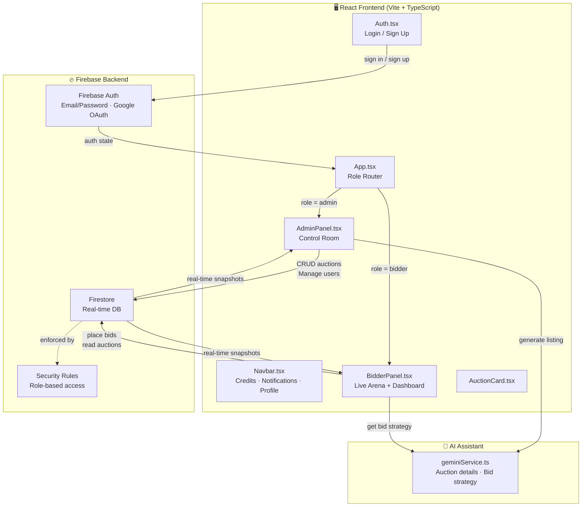
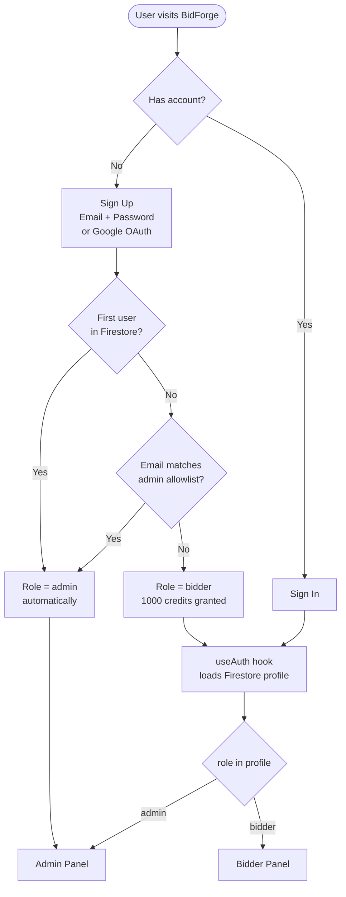
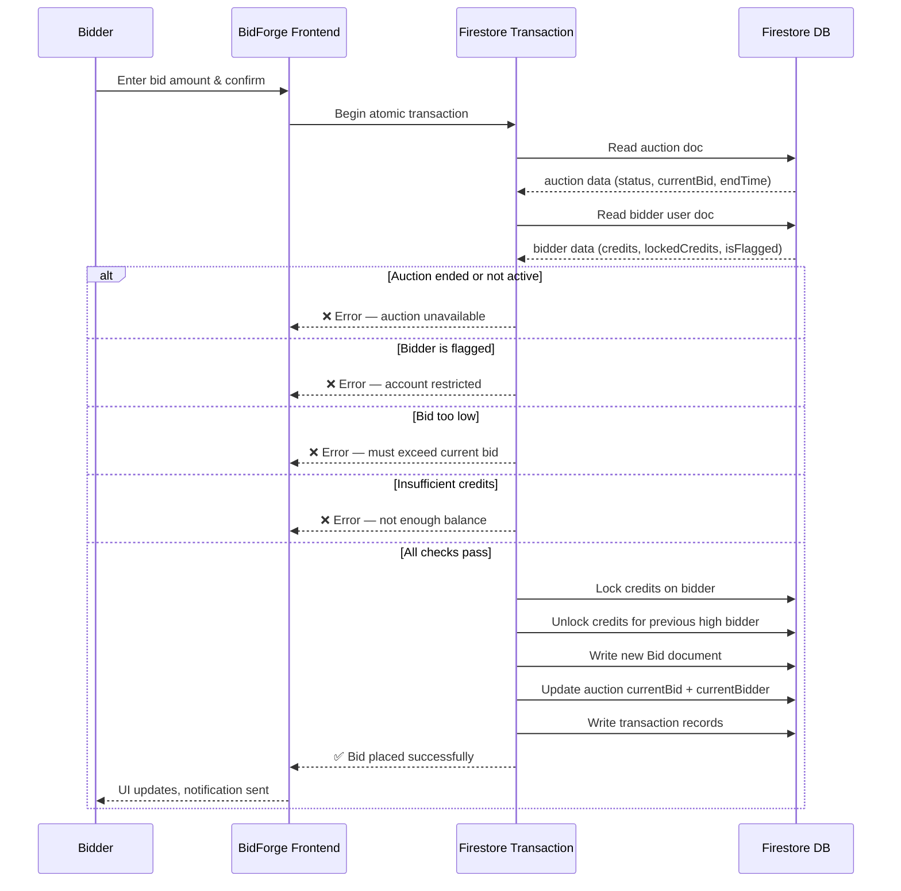
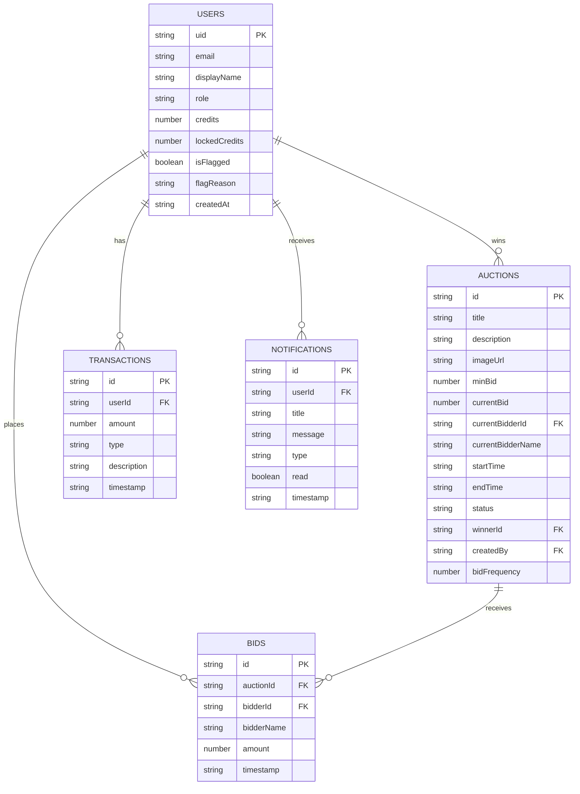
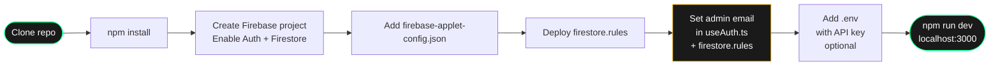
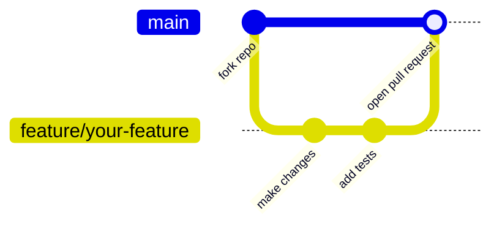

<div align="center">

# ⚒ BidForge

**A real-time competitive auction platform built for speed, clarity, and control.**

[](https://react.dev)
[](https://www.typescriptlang.org)
[](https://firebase.google.com)
[](https://vitejs.dev)
[](https://tailwindcss.com)

*CodeBidz 2026 · Hackathon Submission · Team: Absolute Cinema*

</div>

---

## Overview

BidForge is a full-stack real-time auction platform where participants compete for items using a credit-based system. It features two distinct interfaces — a **Live Arena** for bidders and a **Control Room** for administrators — backed by Firebase's real-time database and secured with granular Firestore rules.

An AI assistant is embedded in both the admin and bidder flows, helping admins draft auction listings and helping bidders form competitive strategies on the fly.

---

## Architecture Overview



---

## User Authentication Flow



---

## Credit & Bidding Transaction Flow



---


---

## Tech Stack

| Layer | Technology |
|---|---|
| **Frontend** | React 19, TypeScript 5.8 |
| **Build Tool** | Vite 6 |
| **Styling** | Tailwind CSS 4, inline CSS tokens |
| **Animation** | Motion (Framer Motion v12) |
| **Icons** | Lucide React |
| **Backend / DB** | Firebase Firestore (real-time) |
| **Auth** | Firebase Authentication (Email/Password + Google OAuth) |
| **AI Assistant** | LLM API via server-side proxy (configurable) |
| **Date Utilities** | date-fns |
| **Utilities** | clsx, tailwind-merge |

---

## Features

### 🔨 Bidder Experience
- **Live Arena** — Browse all active auctions in real time with countdown timers and live current-bid updates
- **Place Bids** — Atomic Firestore transactions lock credits on bid submission and automatically unlock them if outbid
- **AI Bidding Strategy** — Get a suggested bid amount and reasoned strategy for any active auction at the click of a button
- **Personal Dashboard** with four sections:
  - **Overview** — account balance, active bid count, won item count, recent transactions
  - **Current Engagements** — live view of every auction you are actively competing in, with winning/outbid status
  - **Financial History** — full transaction log filterable by event type (top-ups, locks, unlocks, final payments)
  - **Victory Gallery** — all auctions you have won, with final prices
- **Notifications** — real-time in-app alerts (e.g. auction won, outbid)
- **Credit System** — visible available balance and locked balance in the navbar at all times

### 🛠 Admin Control Room
- **System Dashboard** — live stats (active listings, total bid volume, registered users) plus an interactive **3D Bid Heatmap** showing bids-per-minute per active auction (draggable/rotatable)
- **Auction Management** — create, close, and delete auctions; AI-assisted title-to-description + reserve price generation
- **Bid Activity Tab** — four live analytics charts:
  - Bids per minute (line, last 30 min)
  - Top 5 auctions by bid count (bar)
  - Cumulative bid value over time (area)
  - Individual bid amounts (scatter-line, last 50)
  - Each chart is expandable into a full-screen modal with hover tooltips and keyboard navigation
- **Live Bid Feed** — scrollable real-time table of every bid across all auctions, filterable by auction
- **User Management** — search users, top up credits, flag/unflag suspicious accounts with reason
- **Flagged Bidders** — dedicated review queue for flagged accounts
- **Auction Replay** — timeline replay of every bid in a closed auction

### 🔐 Security
- Firestore security rules enforce role-based access at the database level
- Bidding handled entirely in Firestore transactions — no race conditions, no double-spending
- Anti-spam bid rate limiting enforced in the transaction
- Flagged users are blocked from placing bids at the transaction level

### 🎨 UI / UX
- Dark-first design with neon green (credits added) and neon red (credits deducted) currency indicators
- Animated perspective grid on the login page with light/dark toggle
- Profile dropdown: name, UID (copyable), role badge, member since, sign out
- All charts rendered with zero external charting dependencies (pure Canvas 2D API)

---

## Firestore Data Model



---

## Setup Instructions

### Prerequisites

- Node.js 18 or higher
- A Firebase project with **Firestore** and **Authentication** enabled
- An API key for the AI assistant (optional — the app works without it, AI buttons will be disabled)

---

### Setup Flow



---

### 1. Clone the repository

```bash
git clone https://github.com/your-username/bidforge.git
cd bidforge
```

---

### 2. Install dependencies

```bash
npm install
```

---

### 3. Configure Firebase

Create a Firebase project at [console.firebase.google.com](https://console.firebase.google.com), then:

1. Enable **Firestore Database** (production mode)
2. Enable **Authentication** → Sign-in methods → **Email/Password** and **Google**
3. Go to **Project Settings → Your apps → Web app** and copy the config

Create `firebase-applet-config.json` in the project root:

```json
{
  "apiKey": "YOUR_API_KEY",
  "authDomain": "YOUR_PROJECT.firebaseapp.com",
  "projectId": "YOUR_PROJECT_ID",
  "storageBucket": "YOUR_PROJECT.appspot.com",
  "messagingSenderId": "YOUR_SENDER_ID",
  "appId": "YOUR_APP_ID",
  "firestoreDatabaseId": "(default)"
}
```

---

### 4. Deploy Firestore security rules

```bash
npm install -g firebase-tools
firebase login
firebase init firestore
firebase deploy --only firestore:rules
```

Or paste `firestore.rules` directly into the Firebase console Rules editor.

---

### 5. ⚠️ Set your admin email

BidForge grants admin privileges in two ways — first-registered user, and a hardcoded admin email allowlist. To make your email a permanent admin, update **two files**:

**`src/hooks/useAuth.ts`** — find and replace this line (it appears **twice**):

```ts
// BEFORE
const isAdminEmail = firebaseUser.email === 'your-placeholder@email.com';

// AFTER — replace with your actual email
const isAdminEmail = firebaseUser.email === 'you@yourdomain.com';
```

**`firestore.rules`** — find and replace this line:

```js
// BEFORE
request.auth.token.email == "your-placeholder@email.com"

// AFTER
request.auth.token.email == "you@yourdomain.com"
```

> **Note:** The very first user to register on a fresh deployment is also automatically promoted to admin, regardless of email address.

---

### 6. Configure the AI assistant (optional)

```bash
cp .env.example .env
```

Edit `.env`:

```env
GEMINI_API_KEY="your_api_key_here"
```

AI features (auction description generation, bidding strategy) silently disable themselves if no key is present — everything else works normally.

---

### 7. Run the development server

```bash
npm run dev
```

Open [http://localhost:3000](http://localhost:3000).

---

### 8. Build for production

```bash
npm run build
```

Output goes to `dist/`. For Firebase Hosting:

```bash
firebase init hosting   # point to dist/, configure as SPA
firebase deploy --only hosting
```

---

## Project Structure

```
bidforge/
├── src/
│   ├── components/
│   │   ├── AdminPanel.tsx      # Control room: charts, auctions, users, flags
│   │   ├── AuctionCard.tsx     # Single auction card in Live Arena
│   │   ├── Auth.tsx            # Login / sign-up with animated grid + dark toggle
│   │   ├── BidderPanel.tsx     # Live Arena + personal dashboard
│   │   ├── ErrorBoundary.tsx   # Top-level error boundary
│   │   └── Navbar.tsx          # Credits · notifications · profile dropdown
│   ├── contexts/
│   │   └── ThemeContext.tsx     # Auth-page light/dark toggle state
│   ├── hooks/
│   │   └── useAuth.ts          # Firebase auth state + Firestore profile sync
│   ├── lib/
│   │   ├── auctionActions.ts   # Atomic Firestore transaction for placing bids
│   │   ├── firestoreUtils.ts   # Error handling helpers
│   │   └── utils.ts            # formatCurrency, cn()
│   ├── services/
│   │   └── geminiService.ts    # AI API calls: auction details + bid strategy
│   ├── App.tsx                 # Root layout, role-based routing
│   ├── index.css               # Design-system tokens + global overrides
│   ├── main.tsx                # React entry point
│   └── types.ts                # Shared TypeScript interfaces
├── firebase-applet-config.json # Firebase credentials  ← git-ignored
├── firestore.rules             # Firestore security rules
├── .env.example                # Environment variable template
├── vite.config.ts
├── tsconfig.json
└── package.json
```

---

## Known Limitations

| # | Limitation | Impact |
|---|---|---|
| 1 | **No image upload** — auction images are URLs only | Admins must paste image links manually |
| 2 | **No email notifications** — alerts are in-app only | Users must be logged in to see auction outcomes |
| 3 | **No auction scheduling** — auctions start immediately on creation | No future start-time or draft state |
| 4 | **No role management UI** — admin/bidder promotion must be done in Firestore directly | Requires Firebase console access to change roles |
| 5 | **No pagination on large datasets** — bid feed fetches up to 200 records at once | High-volume deployments may need cursor-based queries |
| 6 | **AI features require a valid API key** — buttons are visible but non-functional without one | Minor UX confusion; no graceful disabled state displayed |
| 7 | **Single credit currency** — no real payment gateway integration | Platform is credits-only, not connected to real money |
| 8 | **Google Sign-In requires authorised domains** — must be configured in Firebase console for production | Sign-in with Google will fail on custom domains until added |

---

## Contributing

Pull requests are welcome. For significant changes, please open an issue first to discuss what you would like to change.



1. Fork the repository
2. Create a feature branch: `git checkout -b feature/your-feature`
3. Commit your changes: `git commit -m 'Add your feature'`
4. Push to the branch: `git push origin feature/your-feature`
5. Open a pull request

---

## License

This project is licensed under the [MIT License](LICENSE).

---

<div align="center">
  <sub>Built with ⚒ by Team Absolute Cinema · CodeBidz 2026</sub>
</div>
